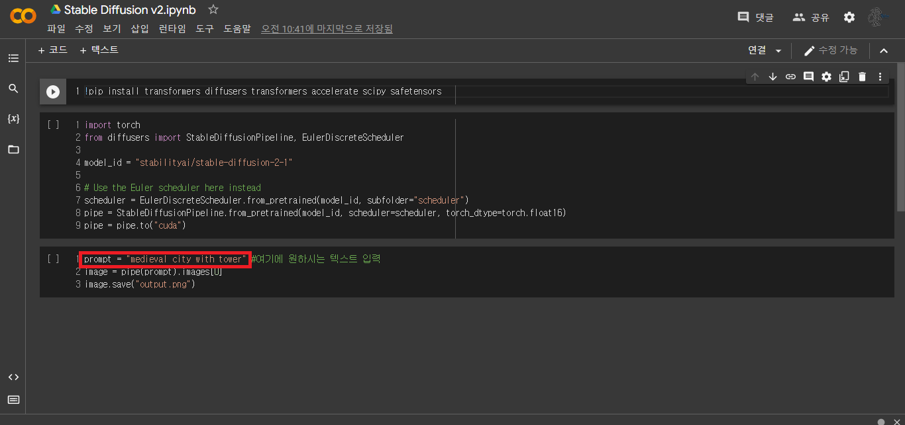
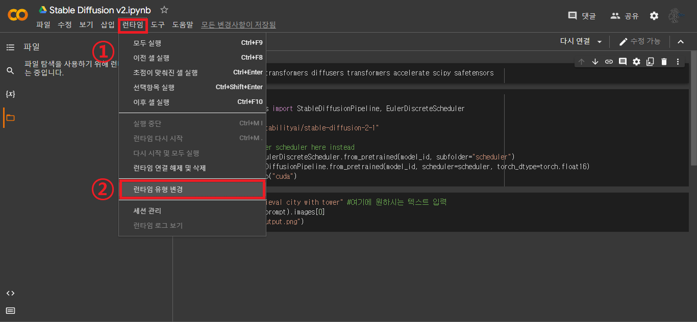
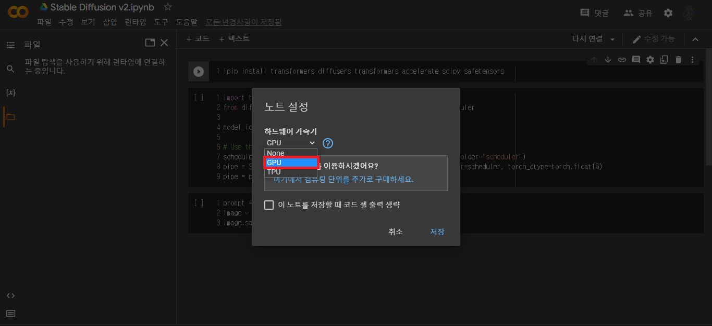
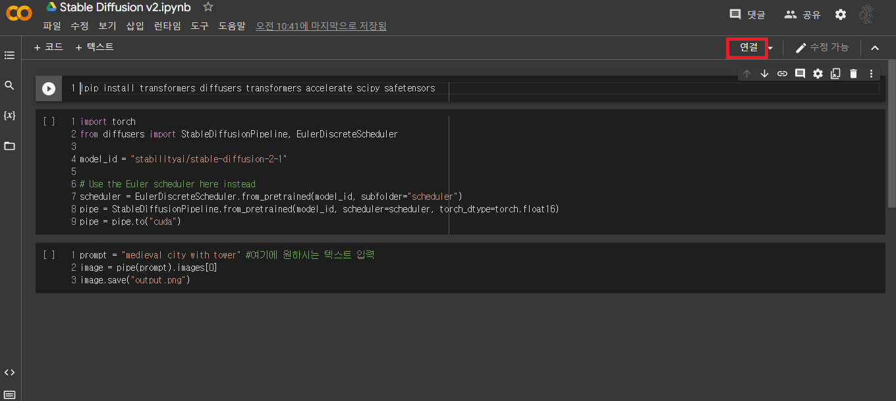
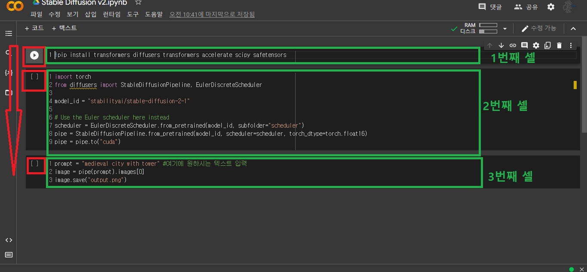
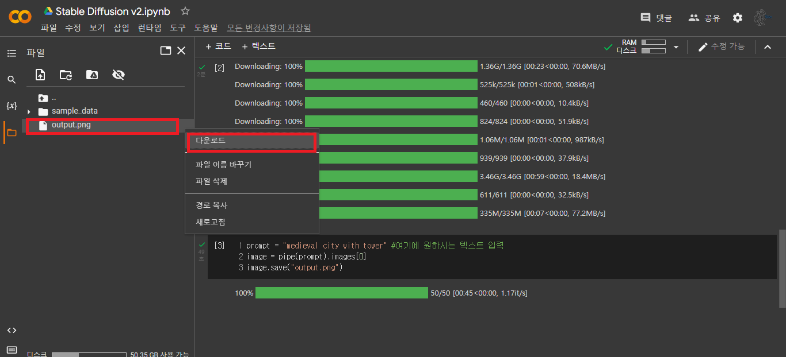
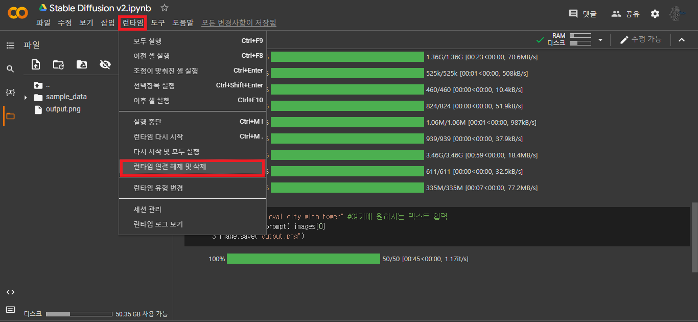

# **Stable Diffusion v2**

Stable Diffusion v2를 이용하여 Text-To-Image를 해주는 코드입니다.

Stable Diffusion은 화제가 되었던 NovelAI의 이미지 제너레이터의 원본입니다. NovelAI에서 해당 모델을 개조한 후 애니메이션 풍 이미지를 학습시킨 것이죠.

본 모델은 애니메이션 풍 이미지를 위주로 학습시키지 않았습니다.

> 해당 모델은 제가 학습시킨 것이 아니라 HuggingFace에 올라온 모델을 가져온 것입니다.
[https://huggingface.co/stabilityai/stable-diffusion-2-1](https://huggingface.co/stabilityai/stable-diffusion-2-1)

----
## **사용 가이드**
### **1. 코랩 접속**
위의 Google Colab 아이콘을 클릭하여 코랩에 접속하세요.

### **2. 입력 변경**

아래쪽에서, **prompt**라는 변수의 값을 원하는 텍스트로 바꿔주세요.

### **3. 런타임 유형 변경 및 연결**

화면 왼쪽 상단의 **런타임 -> 런타임 유형 변경**을 클릭해주세요.  

  
**하드웨어 가속기**를 **None에서 GPU로 바꿔**주세요. 이때, 구글 로그인을 안 하신 분들은 반드시 해주세요. 

이후 화면 오른쪽 위의 **"연결"** 버튼을 눌러주세요. 연결 버튼이 있던 자리에 초록색 체크와 함께 **"연결됨"** 이 뜰 때까지 기다려주세요.

### **4. 실행**

화면에 총 3개의 셀이 보이실텐데, 위에서부터 하나씩 실행해주세요. 셀 클릭 후, **Shift + Enter**를 하셔도 좋고, 셀 왼쪽 부분에 커서를 올리시면 나오는 실행 버튼을 누르셔도 좋습니다.
(런타임 연결 후 첫 실행은 시간이 조금 소요됩니다.)

### **5. 결과물 다운로드**

실행 후 왼쪽에 파일 아이콘을 누르시면, **output.png** 라는 파일이 있을텐데, 해당 파일을 다운로드 받으시면 됩니다.

### **Plus 1. 반복 실행**
그 후에 런타임을 다시 시작 및 종료하기 전까지는 prompt 변수 선언이 있는 3번째 셀만 다시 실행하시면 새로운 output.png를 생성해줍니다.

### **Plus 2. 런타임 종료**
Google Colab에서 GPU를 사용할 때는 대기열이라는 것이 존재합니다. 그동안 GPU 사용 시간이 많으면 나중엔 대기열 후반부로 밀려나서 GPU 사용자가 많을 때 GPU를 사용하지 못하게 됩니다. 이 사용 시간은 한달을 기준으로 초기화됩니다.

정말 필요할 때는 대비하여, 사용하지 않을 때는 런타임을 종료시켜두는 것이 좋습니다.
